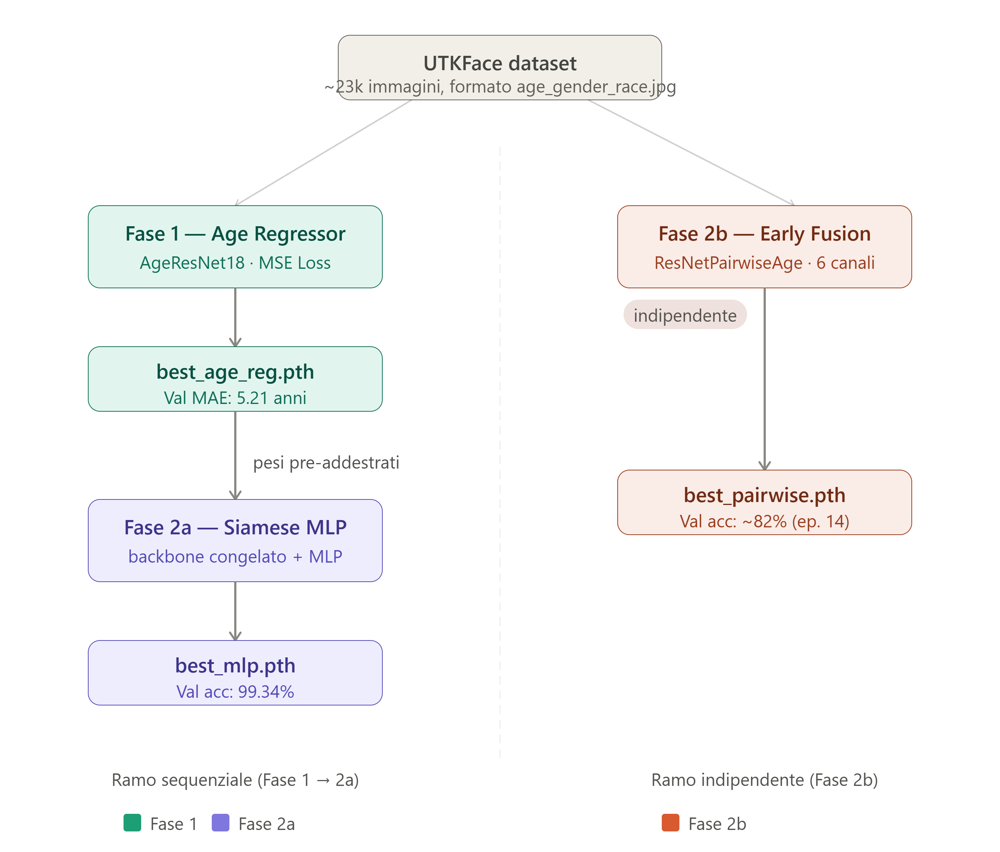
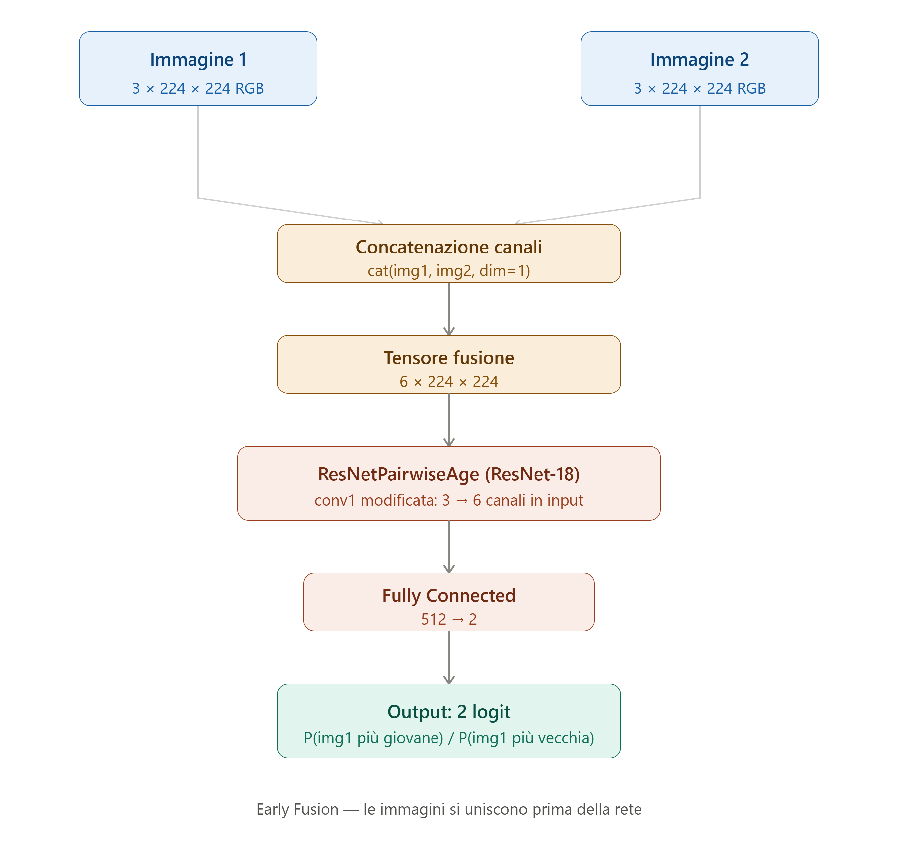
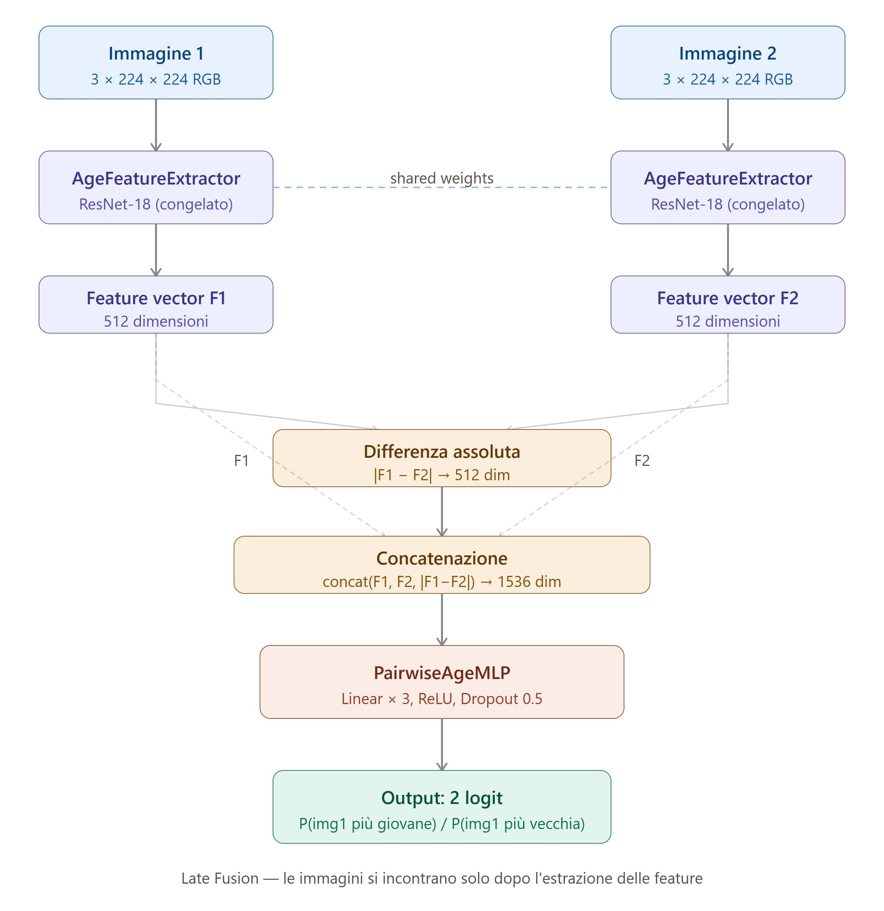
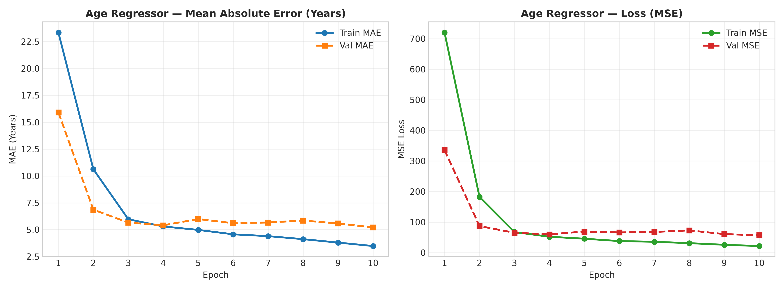
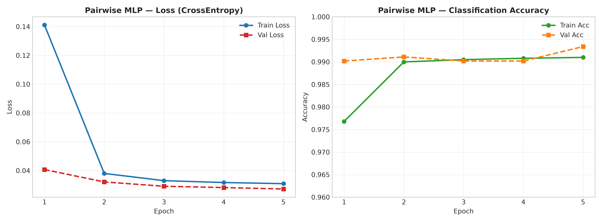
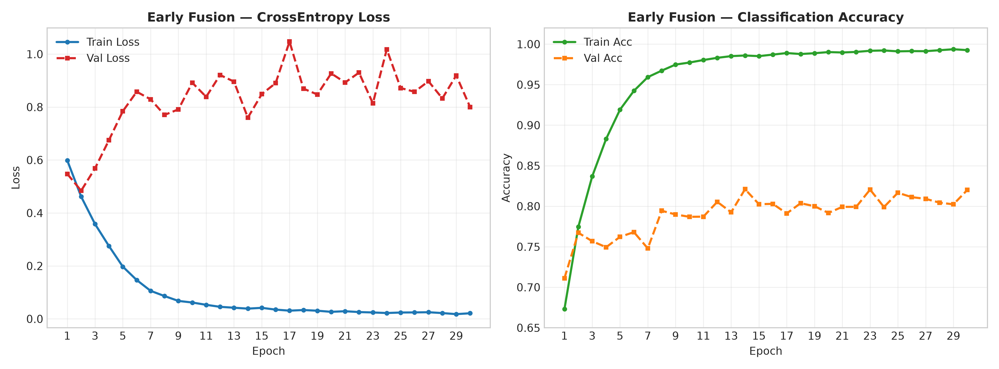

# 🧠 Age Comparison — Pairwise Learning su UTKFace

Progetto di esame pratico per la laurea magistrale.  
L'obiettivo è confrontare due fotografie di volti e determinare quale persona è più giovane,
usando tecniche di **pairwise learning** sul dataset **UTKFace**.

Sono stati implementati e confrontati **due approcci distinti**:

- **Early Fusion (6 canali)** — le due immagini vengono concatenate lungo i canali prima di entrare in una ResNet-18 modificata.
- **Late Fusion — Siamese MLP** — un backbone ResNet-18 pre-addestrato sulla regressione dell'età estrae embedding separati per le due immagini; un MLP riceve `concat(F1, F2, |F1−F2|)` e predice chi è più giovane.

---

## 🎯 Obiettivo del progetto

- Implementare il **pairwise learning** sul dataset UTKFace.
- Addestrare un modello in grado di determinare quale delle due persone in foto è più giovane (classificazione binaria: `0 = img1 più giovane`, `1 = img1 più vecchia`).
- Confrontare due paradigmi di fusione: **early fusion** e **late fusion**.

---

## 📚 Dataset

- **UTKFace**: dataset di volti con età annotata nel nome file (`age_gender_race_timestamp.jpg`).
- Contiene ~23.000 immagini con soggetti di età compresa tra 1 e 116 anni.
- Le coppie vengono generate dinamicamente con un `min_age_gap=10` anni per garantire che le coppie siano distinguibili.

---

## 🏗️ Pipeline



La pipeline è strutturata in due rami:

**Ramo sequenziale (Fase 1 → Fase 2a)**
- La **Fase 1** addestra un regressore dell'età su `SingleAgeDataset`.
- I pesi pre-addestrati alimentano la **Fase 2a**, dove il backbone viene congelato e un MLP impara a confrontare gli embedding.

**Ramo indipendente (Fase 2b)**
- La **Fase 2b** (Early Fusion) parte direttamente da UTKFace senza dipendenze dalla Fase 1.

---

## 🔗 Architetture

### Metodo 1 — Early Fusion (6 canali)

Le due immagini vengono unite **prima** di entrare nella rete. Il primo strato convoluzionale di ResNet-18 viene modificato da 3 a 6 canali in input; i pesi dei 3 canali originali ImageNet vengono duplicati per inizializzare i 6 canali (scelta documentata in letteratura, Two-Stream Networks).



### Metodo 2 — Late Fusion / Siamese MLP

Le due immagini percorrono **rami paralleli con pesi condivisi** (`AgeFeatureExtractor`, backbone congelato). Gli embedding risultanti vengono concatenati insieme alla loro differenza assoluta e passati al classificatore MLP.

Formulazione classica Siamese (Bromley et al.): `concat(F1, F2, |F1−F2|)` → 1536 dimensioni in input all'MLP.



---

## 🧬 Tecniche di Deep Learning implementate

- **Early Fusion (ResNet 6 canali)** — modifica strutturale del primo livello convoluzionale di una ResNet-18 pre-addestrata per accettare tensori a 6 canali, derivati dalla concatenazione delle due immagini RGB. Modello: `ResNetPairwiseAge`.

- **Architettura Siamese (Shared Weights)** — Twin Network che processa i due volti in rami paralleli identici con pesi condivisi. I pesi vengono pre-addestrati tramite regressione d'età continua (MSE Loss) nel modello `AgeResNet18`.

- **Estrazione Embedding Latente** — tramite `AgeFeatureExtractor`, l'ultimo layer lineare della ResNet viene sostituito con un'identità per estrarre vettori ad alta dimensionalità (512 feature per volto).

- **Combinazione Non-Lineare (Late Fusion)** — l'MLP finale (`PairwiseAgeMLP`) processa uno spazio a 1536 dimensioni generato dalla concatenazione $f_1 \oplus f_2 \oplus |f_1 - f_2|$, valutando non solo le caratteristiche assolute ma anche la loro differenza relativa.

- **Smart Sampling (Age Gap)** — generazione dinamica dei dataset con campionamento condizionato (`min_age_gap=10`): il dataloader cicla finché non trova due foto con almeno 10 anni di differenza, garantendo stabilità del gradiente ed evitando coppie visivamente ambigue. È una forma elegante di **Curriculum Learning**: la rete riceve solo esempi chiari e inequivocabili durante il training.

- **Data Augmentation** — nei `train_transform` vengono applicati:
  - `T.RandomHorizontalFlip(p=0.5)` — capovolgimento a specchio
  - `T.ColorJitter(brightness, contrast, saturation, hue)` — variazione casuale delle condizioni di luce
  - `T.RandomRotation(degrees=10)` — rotazioni casuali (solo Early Fusion)

  Queste trasformazioni costringono la rete a concentrarsi sulle texture della pelle (rughe, contorni) anziché memorizzare il posizionamento esatto dei pixel o le condizioni di illuminazione originali.

- **Overlay Inference UI** — modulo di inferenza con output grafico tramite Matplotlib: il verdetto viene sovrapposto alle immagini insieme al grado di incertezza calcolato tramite confidenza Softmax.

---

## ⚙️ Metodologia

### Fase 1 — Age Regressor

| Parametro | Valore |
|-----------|--------|
| Modello | ResNet-18 (`AgeResNet18`) |
| Loss | MSE |
| Epoche | 10 |
| Learning rate | 1e-4 |
| Batch size | 64 |
| Best epoch | 10 |
| Val MSE | 56.82 |
| Val MAE | **5.21 anni** |
| Train MAE finale | 3.48 anni |

> Lieve overfitting dall'epoca 5 (train MAE scende, val MAE si stabilizza ~5.5y). Il regressore serve principalmente come **feature extractor** per la Fase 2a.



---

### Fase 2a — Siamese MLP (Late Fusion)

| Parametro | Valore |
|-----------|--------|
| Modello | `AgeFeatureExtractor` (congelato) + `PairwiseAgeMLP` |
| Loss | CrossEntropy |
| Epoche | 5 |
| Learning rate | 1e-5 |
| Batch size | 64 |
| Best epoch | 5 |
| Val loss | 0.0272 |
| Val accuracy | **99.34%** |
| Train accuracy | 99.10% |

> L'alta accuracy riflette il `min_age_gap=10`: le coppie hanno almeno 10 anni di differenza, rendendole relativamente facili da distinguere per un backbone già allenato sull'età.



---

### Fase 2b — Early Fusion (6 canali)

| Parametro | Valore |
|-----------|--------|
| Modello | `ResNetPairwiseAge` (ResNet-18 con conv1 a 6 canali) |
| Loss | CrossEntropy |
| Epoche | 30 |
| Learning rate | 1e-4 |
| Batch size | 64 |
| Best checkpoint (val loss) | epoca 2 — val loss 0.4841, val acc 76.72% |
| Best val accuracy osservata | **82.10%** (epoca 30) |
| Train accuracy finale | 99.26% |

> La val loss sale dall'epoca 3 (overfitting sulla confidenza) mentre la val accuracy continua a migliorare fino all'82%. Il checkpoint salvato corrisponde all'epoca 2 perché il criterio di salvataggio è basato sulla val loss — un punto di discussione interessante riguardo alla scelta della metrica di selezione del modello.



---

## 📊 Riepilogo risultati

| Modello | Val Accuracy | Note |
|---------|-------------|------|
| Early Fusion (best checkpoint ep.2) | 76.72% | Salvato su val loss minima |
| Early Fusion (best accuracy ep.30) | **82.10%** | Migliore acc osservata |
| Siamese MLP (Late Fusion) | **99.34%** | Backbone age-aware + min_gap=10 |

---

## 🗂️ Struttura del progetto

```
age-comparison/
├── data/
│   └── UTKFace/               # dataset (non incluso nel repo)
├── models/                    # checkpoint salvati dal training
│   ├── best_age_reg.pth       # Fase 1 — Age Regressor
│   ├── best_mlp.pth           # Fase 2a — Siamese MLP
│   └── best_pairwise.pth      # Fase 2b — Early Fusion
├── runs/                      # log TensorBoard
├── images/
    ├── age_comparison_pipeline.png       # Diagramma di flusso completo.
    ├── early_fusion_diagram.png
    ├── late_fusion_siamese_diagram.png   # Schemi architetturali.
    ├── fase1_age_regressor.png
    ├── fase2_pairwise_mlp.png
    ├── fase3_early_fusion.png            # Grafici di addestramento TensorBoard per ogni fase.
    ├── loss_mse_curve.png
    ├── mae_years_curve.png
    ├── training_results.png              # Metriche dettagliate.
├── age_regression_model.py    # AgeResNet18 + AgeFeatureExtractor
├── datasets.py                # SingleAgeDataset + PairwiseAgeDataset
├── inference_example.py       # script di inferenza da terminale
├── model.py                   # ResNetPairwiseAge (Early Fusion 6ch)
├── pair_mlp_model.py          # PairwiseAgeMLP
├── train_age_regressor.py     # training Fase 1
├── train_pair_mlp.py          # training Fase 2a
├── train_pairwise.py          # training Fase 2b
├── utils.py                   # TensorBoard writer, save/load checkpoint
└── age_comparison_notebook.ipynb  # notebook unificato (tutte le fasi)
```

---

## 🚀 Utilizzo

### Prerequisiti

Il progetto utilizza l'ambiente conda `utk_pairs`. Per ricrearlo:

```bash
conda create -n utk_pairs python=3.10
conda activate utk_pairs
pip install torch torchvision tensorboard Pillow
```

Il dataset UTKFace va posizionato in `data/UTKFace/` con immagini nel formato `age_gender_race_timestamp.jpg`.

### Training

```python
# Fase 1 — Age Regressor
age_reg_model = train_age_regressor(utk_root="data/UTKFace", epochs=10, lr=1e-4)

# Fase 2a — Siamese MLP (richiede Fase 1)
mlp_model = train_pairwise_mlp(
    utk_root="data/UTKFace",
    age_regressor_ckpt="models/best_age_reg.pth",
    epochs=5, lr=1e-5,
    age_reg_model=age_reg_model,  # riusa il modello già in memoria
)

# Fase 2b — Early Fusion (indipendente)
ef_model = train_early_fusion(utk_root="data/UTKFace", epochs=30, lr=1e-4)
```

### Inference

```python
result = infer(
    img_path1="foto1.jpg",
    img_path2="foto2.jpg",
    ckpt_path="models/best_pairwise.pth",  # oppure best_mlp.pth
)
# Output: "PIÙ GIOVANE" se la prima foto è più giovane, "PIÙ VECCHIA" altrimenti
```

### TensorBoard

```bash
tensorboard --logdir runs
```

---

## 🧪 Scelte progettuali

- **`min_age_gap=10`** nel `PairwiseAgeDataset`: le coppie hanno almeno 10 anni di differenza per garantire che siano distinguibili. Abbassarlo renderebbe il task più realistico ma più difficile.
- **Il best checkpoint si salva in base alla val loss**, non alla val accuracy. Per l'Early Fusion questo è subottimale — la val accuracy migliore (82%) si trova all'epoca 30, non all'epoca 2 salvata.
- **Il feature extractor è completamente congelato** nella Fase 2a (sia `.eval()` che `requires_grad=False`).
- **I pesi del primo conv (6ch) sono inizializzati duplicando i pesi ImageNet** dei 3 canali originali, non randomizzati (Two-Stream Networks).
- **`PairwiseAgeMLP` usa `concat(F1, F2, |F1−F2|)`** come input — formulazione classica Siamese (Bromley et al.).

---

## 📖 Riferimenti

- Bromley et al., *Signature Verification using a Siamese Time Delay Neural Network* (1994)
- He et al., *Deep Residual Learning for Image Recognition* (2016)
- Zhang et al., *Age Progression/Regression by Conditional Adversarial Autoencoder* — UTKFace dataset
- Riferimento stilistico: [`bassemr/one-shot-learning`](https://github.com/bassemr/one-short-learning) — One-Shot Learning su CIFAR-100 con Siamese Network
